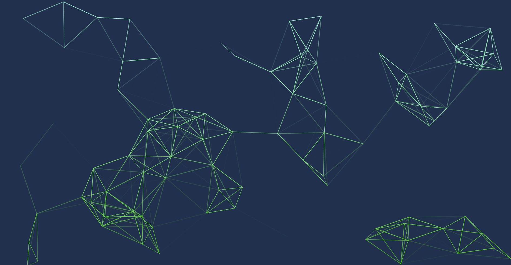

# Generative art effect made with Typescript and P5JS

Interactive version of all effect available here : [https://evayann.github.io/WebArts/](https://evayann.github.io/WebArts/)

## Planets Circle

[](https://github.com/evayann/WebArts/blob/main/src/planetsCircle/planetsCircle.ts)

## Shape of Shape

[](https://github.com/evayann/WebArts/blob/main/src/shapeOfShape/shapeOfShape.ts)

## Corridor Lines

[](https://github.com/evayann/WebArts/blob/main/src/corridorLines/corridorLines.ts)

## Spiral

[](https://github.com/evayann/WebArts/blob/main/src/spiral/spiral.ts)

## Spiral Cube

[](https://github.com/evayann/WebArts/blob/main/src/spiralCube/spiralCube.ts)

## Vortex

[](https://github.com/evayann/WebArts/blob/main/src/vortex/vortex.ts)

## Spiral Tunnel

[](https://github.com/evayann/WebArts/blob/main/src/spiralTunnel/spiralTunnel.ts)

## Line Circle

[](https://github.com/evayann/WebArts/blob/main/src/lineCircle/lineCircle.ts)

## Drop Gradient

[](https://github.com/evayann/WebArts/blob/main/src/dropGradient/dropGradient.ts)

## Square From Little

[](https://github.com/evayann/WebArts/blob/main/src/squareFromLittle/squareFromLittle.ts)

## Circle Split

[](https://github.com/evayann/WebArts/blob/main/src/circleSplit/circleSplit.ts)

## Squares Loop

[](https://github.com/evayann/WebArts/blob/main/src/squaresLoop/squaresLoop.ts)

## Line Sphere

[](https://github.com/evayann/WebArts/blob/main/src/lineSphere/lineSphere.ts)

## Grid Lines

[](https://github.com/evayann/WebArts/blob/main/src/gridLines/gridLines.ts)

## Circle Image

[](https://github.com/evayann/WebArts/blob/main/src/circleImage/circleImage.ts)

## Ascii Cam

[](https://github.com/evayann/WebArts/blob/main/src/asciiCam/asciiCam.ts)

## Circle Square

[](https://github.com/evayann/WebArts/blob/main/src/circleSquare/circleSquare.ts)

## Square Circle Gradient

[](https://github.com/evayann/WebArts/blob/main/src/squareCircleGradient/squareCircleGradient.ts)

## Pendulum

[](https://github.com/evayann/WebArts/blob/main/src/pendulumDraw/pendulumDraw.ts)

## Noise Color

[](https://github.com/evayann/WebArts/blob/main/src/noiseColor/noiseColor.ts)

## Line Effect

[](https://github.com/evayann/WebArts/blob/main/src/lineEffect/lineEffect.ts)

## Circle Automata

[](https://github.com/evayann/WebArts/blob/main/src/circleAutomata/circleAutomata.ts)

## Flags

[](https://github.com/evayann/WebArts/blob/main/src/flags/flags.ts)

## Simple Grid

[](https://github.com/evayann/WebArts/blob/main/src/simpleGrid/simpleGrid.ts)


## Project setup
```
npm install
```

### Compiles and hot-reloads for development
```
npm run serve
```

### Compiles and minifies for production
```
npm run build
```

### Lints and fixes files
```
npm run lint
```

### Customize configuration
See [Configuration Reference](https://cli.vuejs.org/config/).
